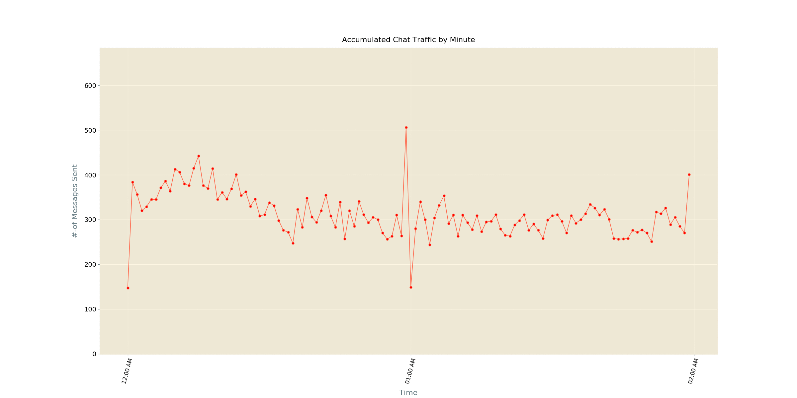

# tgnize



How about another exported Telegram Chat analyzer ? :wink:

## nomenclature
Telegram + _( Chat )_ Analyze = tgnize

## motivation
- I'm always interested in learning more about data, which is why I thought about taking a deeper look into Telegram Chats _( mostly groups )_, I participate in.
- I exported chat data _( excluding audios, videos and images etc. )_, of [Devs Chat](https://t.me/joinchat/BkBvqUQUj4VKPmFSSNPQSw) group, using Telegram Desktop Client, which are nothing but some HTML, CSS & JS files
- I created an object model, into which I populated parsed Chat data, so that I can manipulate it well
- Then I started plotting animated charts & much more _( a lot of work remaining though )_, to depict how participants contributed to chat
- It also lets me understand my chat activity pattern(s) i.e. in which hour of the day I'm mostly active / inactive in Chat
- Or how another peer is spending their time is Chat
- What's mostly used words / mostly used bots / mostly used Emoji etc. in Chat

## caution
This project doesn't expect you to use any exported Chat for manipulating any participant or use extracted data _( sleep patterns, daily activity pattern of participants )_ for doing some harmful activity to any participant.

**If users use it for malicious purpose(s), it's not author's responsibility !!!**

I suggest you not to use it for manipulating someone else. Thank you for understanding :wink:

## data source
Here I'm using [Devs Chat](https://t.me/joinchat/BkBvqUQUj4VKPmFSSNPQSw)'s, exported Chat data set for testing these scripts. So all plots ( to be :wink: ) generated, present in this repository, are result of application of scripts on [Devs Chat](https://t.me/joinchat/BkBvqUQUj4VKPmFSSNPQSw)'s exported Chat data.

~Template data set is present [here](.). It holds all messages of [Devs Chat](https://t.me/joinchat/BkBvqUQUj4VKPmFSSNPQSw) upto _03/11/2019_ from initialization of group.~

**For respecting privacy of all users, I'm removing that data source from this public repo. Export chat data for your own need.**

### exporting chat
For exporting chat data for [Devs Chat](https://t.me/joinchat/BkBvqUQUj4VKPmFSSNPQSw) group of Telegram, I used Official Telegram Desktop Client. Exporting was done, while only including text messages _( no images, videos or audios )_, which are nothing but a bunch of HTML files.

If you want to run these scripts on your machine, make sure you've Telegram Desktop Client installed.

```shell script
$ sudo snap install telegram-desktop # run on your linux terminal
```
Log into your account and choose which chat to export. Well this expoting procedure can take some time, depending upon age & activeness of Chat.

## usage
- Download this zip from [here](https://github.com/itzmeanjan/tgnize/releases)
- Unzip it into a suitable directory on your machine
- Get into `tgnize` directory

```shell script
$ cd tgnize
$ tree -h
.
├── [4.2K]  app.py
├── [4.0K]  docs
│   └── [1.8K]  minuteBasedAccumulatedTraffic.md
├── [ 227]  install
├── [1.0K]  LICENSE
├── [4.0K]  model
│   ├── [ 245]  activity.py
│   ├── [9.8K]  chat.py
│   ├── [ 332]  event.py
│   ├── [ 100]  __init__.py
│   ├── [1.3K]  message.py
│   ├── [ 515]  plotDataRange.py
│   └── [1.1K]  user.py
├── [4.0K]  plotting_scripts
│   ├── [ 100]  __init__.py
│   ├── [ 169]  messageCount.py
│   └── [ 11K]  minuteBasedAccumulatedTraffic.py
├── [2.7K]  README.md
├── [  56]  requirements.txt
├── [  47]  tgnize
└── [4.4K]  util.py

3 directories, 18 files
```
- Make sure you've `python3-pip` installed, which will be required for installing python modules ( i.e. beautifulsoup4, matplotlib etc. )
- Run `install` script ( BASH script ), which will download all required dependencies into your machine

```shell script
$ ./install
```
- For generating animated plots, you'll need to have `imagemagick` installed on your machine. Install it using your system package manager.

```shell script
$ sudo apt-get install imagemagick # for debian based distros
$ sudo dnf install imagemagick # for fedora
```
- Now you need to add installation path of `tgnize`, into your **PATH** variable

```shell script
$ pwd # copy it
```
- If you're on BASH, find `.bashrc` under your home directory, if not found create a file with that name
- Add follwing line at end of that file, while replacing `paste-here` section with installation path of `tgnize`

```shell script
export PATH="$PATH:paste-here"
```
- Now close this terminal window & open a new one
- You'll have `tgnize`, executable BASH script present under downloaded zip, on your path. Simply invoke `tgnize` directly, to be sure things are working as they're supposed to be

```shell script
$ cd # get to home directory
$ tgnize
[+]tgnize v0.1.0 - How about another Telegram Chat Analyzer ?

	$ tgnize `path-to-exported-chat-dir` `path-to-sink-dir`

[+]Author: Anjan Roy<anjanroy@yandex.com>
[+]Source: https://github.com/itzmeanjan/tgnize ( MIT Licensed )

[!]Error : Improper Invocation of `tgnize`
```
- It's asking you to properly invoke script, by giving source directory _( holding exported telegram chat, of a single Chat, may be a lot of files in case of large Chats )_ & sink directory _( will hold generated plots / charts )_
- If you've already exported some Telegram chat, consider invoking this script, to understand how you spent your time in Chat

## progress

**This project is in its infancy, a lot of features to be added. If you've something in your mind, don't hesitate to create an issue or make a PR**

- [x] [Depiction of Accumulated Chat Traffic _( for whole Chat along with top **X** chat participants )_](./docs/minuteBasedAccumulatedTraffic.md)
- [ ] Contribution of Chat Participants to Chat
- [ ] Overall Activity of Chat _( for a specified period of time )_
- [ ] Emoji Analysis
- [ ] Text Analysis

_Got some new idea ? Make a PR_ :wink:

**Work in Progress** - _coming with more details soon_
